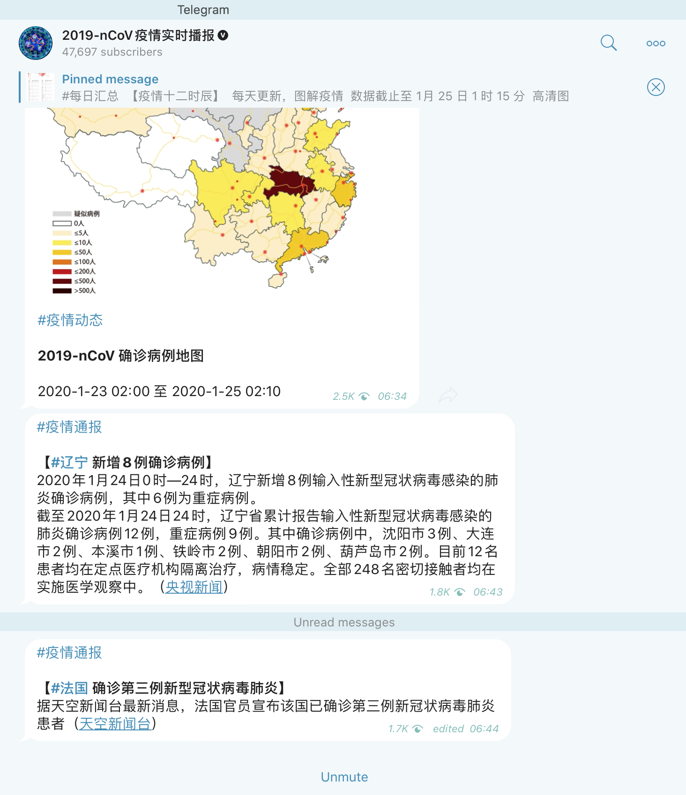

# 2019-nCoV疫情实时播报🅥｜墙内传播版

 

**传播📣链接**：http://2019ncov.tk

 

电报上的那个频道是我知道的汇总国内官方渠道的疫情数据，做得最好的。我有天天看。（当然我也知道官方消息只有基本参考价值）。

但我这两天在安利这个频道时犯了难，因为我得先让朋友下载个 Telegram，还得教他翻墙......
考虑到这个难题，我连夜写了这个网页：**[http://2019ncov.tk]( http://2019ncov.tk)** 

在**国内可以直接访问查看频道更新的消息。**

（建议发给国内没有 Telegram 账户的朋友使用。）

数据来自：Telegram [同名频道](https://t.me/nCoV2019)提供的[RSS 源]( https://rsshub.app/telegram/channel/nCoV2019)

**项目预览：（Mobile）**

**同名Telegram频道长这样：**

